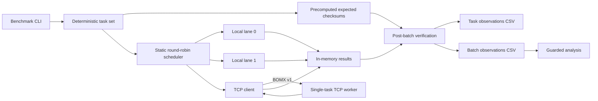

# Beyond One Machine

Beyond One Machine is an independent C++20 research instrument for asking:

> Under what combinations of task granularity, parallelism, and communication
> overhead does adding compute capacity across a machine boundary improve throughput
> compared with single-node execution?

The experiment matters because adding a machine also adds serialization, transport,
synchronization, and hardware differences. A negative result is valid: the software
is designed to reveal boundaries, not guarantee speedup.

The project is a user-space distributed-execution experiment inspired by one
performance question raised by DEX. It is not an implementation or reproduction of
DEX, transparent thread or process migration, distributed shared memory, cross-ISA
execution migration, or a production distributed-computing framework.

> Do not assume that more machines make software faster. Measure when they do,
> understand when they do not, and learn what happens at the boundary.

## Status

V1 implements the deterministic workload, versioned TCP protocol, worker and
coordinator CLIs, four execution modes, persistent/fresh connections, correctness
verification, timing, raw CSV output, environment records, and guarded analysis.
Localhost functional tests pass on ARM64 macOS with AppleClang. No controlled
performance study has been run and no speedup or break-even claim is made.

Verified locally before these release corrections:

- ARM64 macOS, AppleClang 21.0.0, Release build and all CTest tests.
- The same local configuration with AddressSanitizer and UndefinedBehaviorSanitizer.
- Python 3.14.7 golden-reference and analysis tests.

Hosted GitHub Actions verification for correction commit `ae847423` passed in
[workflow run 37781195605](https://github.com/sad1kul/distributed-execution-benchmark/actions/runs/37781195605):

- Ubuntu GCC.
- Ubuntu Clang.
- Ubuntu Clang with AddressSanitizer and UndefinedBehaviorSanitizer.
- Windows MSVC x64.
- macOS-14 hosted Clang.

Windows ARM64, Linux ARM64, macOS x86-64, and real multi-machine operation remain
unverified. Controlled two-machine performance evaluation remains pending.

## Architecture



The four modes are `local-1`, `remote-1`, `local-2`, and `local-remote`. Two-lane
modes use fixed `task_index % 2` assignment. The worker executes one task at a time.

## Build and correctness tests

```sh
cmake -S . -B build -DCMAKE_BUILD_TYPE=Release
cmake --build build --parallel
ctest --test-dir build --output-on-failure
python3 tools/reference.py --check
python3 tools/reference.py --write
git diff --exit-code -- tests/golden_vectors.json tests/golden_vectors.inc
```

CTest covers the Sprint 1 T01-T31 suite, protocol serialization and malformed frames,
local execution, TCP lifecycle and failure handling, all four modes, raw output,
analysis safeguards, and a subprocess localhost smoke test. The Python oracle remains
independent of the C++ implementation.

## Worker

Loopback is the default and safest configuration:

```sh
./build/bom_worker --bind 127.0.0.1 --port 9000 --message-timeout-ms 300000
```

The worker prints `READY address:port` after binding. Press Ctrl-C to terminate the
process. Protocol SHUTDOWN closes only one client session. To accept a trusted remote
connection, pass an explicit interface address to `--bind`.

V1 provides no authentication or encryption and must be used only on trusted
networks. Do not expose the worker to the public Internet.

## Run the four modes

Every invocation requires mode, dimension, task count, base seed, measured
repetitions, and a distinct output directory. Warm-up defaults to one.

```sh
./build/bom_benchmark --mode local-1 --dimension 64 --task-count 4 \
  --base-seed 42 --warmup-count 1 --repetitions 5 \
  --output-dir results/raw/local-1

./build/bom_benchmark --mode local-2 --dimension 64 --task-count 4 \
  --base-seed 42 --warmup-count 1 --repetitions 5 \
  --output-dir results/raw/local-2

./build/bom_benchmark --mode remote-1 --dimension 64 --task-count 4 \
  --base-seed 42 --worker-host 127.0.0.1 --worker-port 9000 \
  --connection-mode persistent --warmup-count 1 --repetitions 5 \
  --output-dir results/raw/remote-1

./build/bom_benchmark --mode local-remote --dimension 64 --task-count 4 \
  --base-seed 42 --worker-host 127.0.0.1 --worker-port 9000 \
  --connection-mode persistent --warmup-count 1 --repetitions 5 \
  --output-dir results/raw/local-remote
```

Use `--connection-mode fresh-per-task` to include a new connection, HELLO exchange,
task, result, and teardown for each remote task. Network deadlines are configurable
with `--connect-timeout-ms` and `--message-timeout-ms`.

At least two tasks are required before a two-worker mode can support a scale-out
comparison. Small localhost commands are functional smoke tests only.

## Raw output and environment records

Each output directory contains:

- `task_observations.csv`: one row per observed task, including coordinator-relative
  dispatch/completion times, worker phase durations, checksum, validity, and failure.
- `batch_observations.csv`: one authoritative row per measured batch, including total
  duration, connection setup duration, completion counts, validity, and failure.
- `environment.json`: automatically detected coordinator/build data and explicit
  `unknown` fields that require manual characterization.

Expected checksums are prepared before warm-up and measured timing. Verification and
CSV writing happen after the stored batch duration. Failed measured batches are kept
and are never retried silently. Every invocation receives a distinct run ID; existing
observation files are never overwritten silently.

## Analysis

Supply directories for matched local-1 and selected-mode runs:

```sh
python3 tools/analyze.py \
  --input-dir results/raw/local-1 \
  --input-dir results/raw/local-2 \
  --input-dir results/raw/local-remote \
  --summary results/summary/summary.csv \
  --excluded results/summary/excluded.csv
```

The tool calculates throughput, median, nearest-rank p95, speedup, nominal two-worker
efficiency, and relative machine-boundary penalty. It refuses missing baselines,
mismatched configurations, duplicate observations, incompatible coordinator/build
records, loopback remote data, incomplete two-host provenance, and mixed remote-worker
or network configurations. Numeric loopback classification includes the complete IPv4
loopback range and IPv4-mapped IPv6 addresses. A non-loopback address is not evidence
of a machine boundary: controlled remote rows require manually documented, distinct
`coordinator_host_id` and `worker_host_id`, `remote_worker_provenance`, remote hardware,
network RTT/environment, host type, and power mode. Local-only baselines remain usable
without remote metadata. Invalid, single-task two-worker, and smoke-test rows are
reported separately. The penalty is not isolated network overhead and may reflect
hardware, memory, scheduling, and other system differences.

## Methodological limitations

- Localhost validates correctness and instrumentation, not multi-machine performance.
- Static round robin can be imbalanced on unequal machines.
- Worker durations are phase durations, not cross-machine timestamps.
- Remote hardware and network metadata require manual completion.
- Persistent teardown is outside the stored batch time; fresh teardown is inside.
- No controlled two-machine measurements or research charts exist yet.

See [experimental protocol](docs/experimental-protocol.md), [wire protocol](docs/message-protocol.md),
[decision log](docs/decision-log.md), [roadmap](docs/research-roadmap.md), and
[implementation history](docs/implementation-history.md).

## DEX relationship and citation

DEX studies scaling applications beyond machine boundaries using operating-system
mechanisms including thread migration and distributed shared memory. This project
does neither; it uses explicit user-space task dispatch over TCP.

Sang-Hoon Kim, Ho-Ren Chuang, Robert Lyerly, Pierre Olivier, Changwoo Min, and Binoy
Ravindran. “DEX: Scaling Applications Beyond Machine Boundaries.” IEEE International
Conference on Distributed Computing Systems (ICDCS), 2020.
